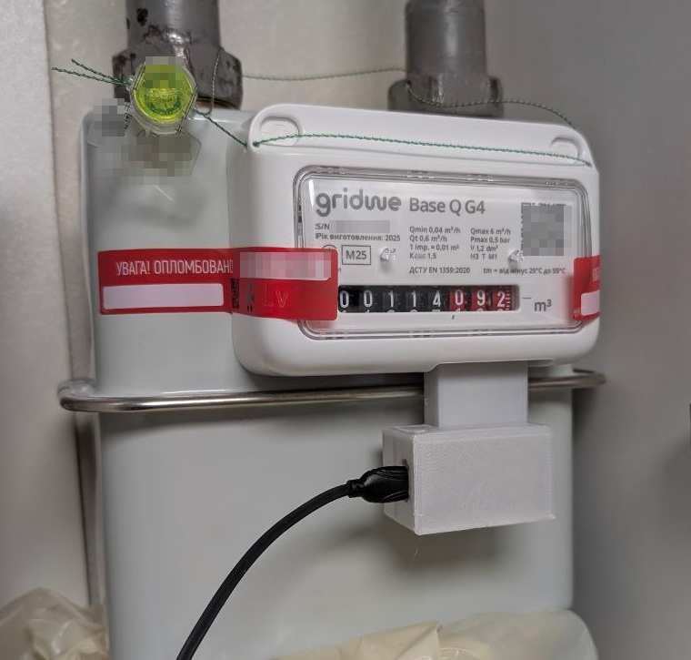
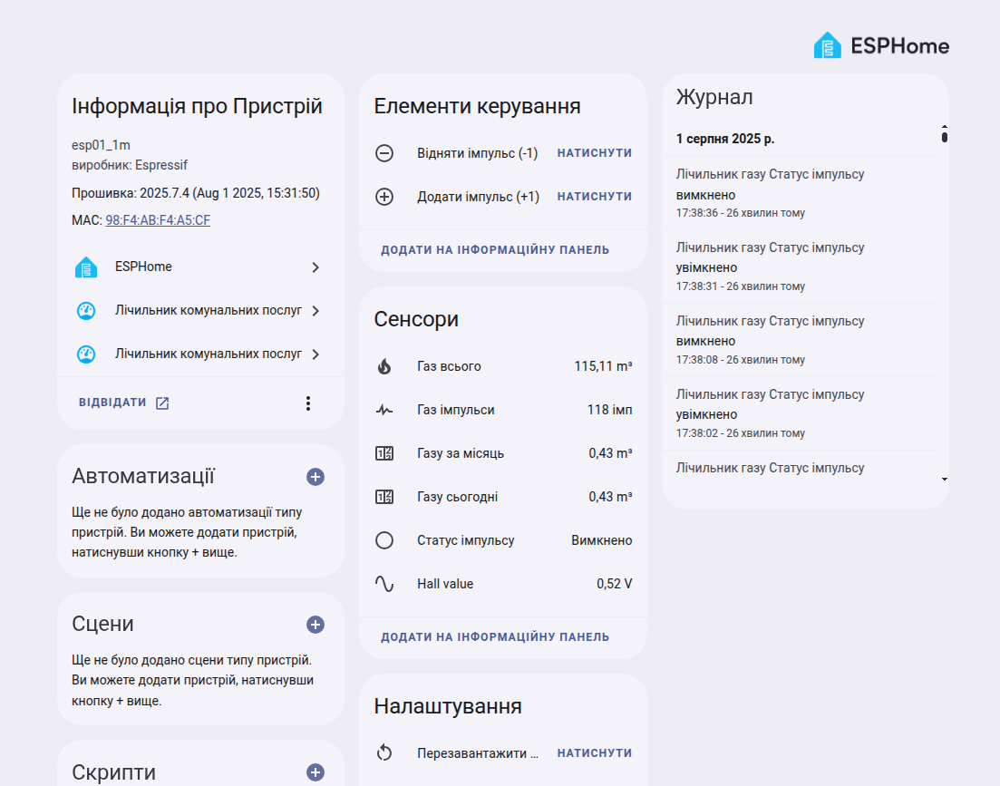

# ESP8266 Gas Meter Pulse Reader (ESPhome + Home Assistant)

This project implements a gas meter pulse counter using ESPhome, an ESP8266 (D1 Mini v4.0.0), and a Hall sensor (49E). It reads impulses from a mechanical gas meter and publishes the readings to Home Assistant.

This integration is very inexpensive because it requires very few components, and all of them are cheap and widely available.

**Approximate component costs:**
- ESP8266 D1 Mini v4.0.0: ~$1.5–3 ([Buy on AliExpress](https://a.aliexpress.com/_EwQjbHk))  
  *(This is the board I used, but any ESP8266 or ESP32 board will work.)*
- Hall sensor 49E: ~$0.20–0.50 ([Buy on AliExpress](https://a.aliexpress.com/_EyKh9nC))
- Wires: ~$0.10
- (Optional) 3D printed mount: ~$0.50

**Total estimated cost:** ~$2.3–4

## Features

- Counts gas meter impulses using a Hall sensor.
- Stores the pulse count in flash memory to survive power outages.
- Publishes total gas usage and impulse count to Home Assistant.
- Manual correction buttons for adding/subtracting impulses.
- Web server and OTA update support.
- Includes a 3D print file for mounting on the Gridwe Base Q G4 gas meter.

## Wiring Diagram

```
D1 Mini v4.0.0         Hall Sensor 49E
+--------------+   +----------------+
|      3V3     |---| VCC (Pin 1)    |
|      G       |---| GND (Pin 2)    |
|      A0      |---| Vout (Pin 3)   |
+--------------+   +----------------+
```

**Connection details:**
- Connect Hall sensor VCC to 3.3V on D1 Mini.
- Connect Hall sensor GND to GND on D1 Mini.
- Connect Hall sensor OUT to A0 (analog input) on D1 Mini.

## Configuration

To customize for your own setup, edit the following parameters in `project.yaml`:

```yaml
globals:
  - id: m3_gas_per_pulse
    type: float
    initial_value: '0.01'         # <-- Set this to your meter's value (m³ per impulse)
  - id: total_gas_m3_start_value
    type: float
    initial_value: '113.933'      # <-- Set this to your current meter reading (m³)
wifi:
  ssid: !secret wifi_ssid         # <-- Set your WiFi SSID in secrets.yaml
  password: !secret wifi_password # <-- Set your WiFi password in secrets.yaml
sensor:
  - platform: homeassistant
    id: pulse_counter_from_ha
    entity_id: input_number.gas_impulse_count # <-- Ensure this entity exists in Home Assistant
```

## Home Assistant Helper: `input_number.gas_impulse_count`

This project requires a Home Assistant helper called `input_number.gas_impulse_count`.  
This is an [Input Number](https://www.home-assistant.io/integrations/input_number/) entity in Home Assistant, used to store and restore the pulse count value.  
It allows the ESP8266 to synchronize the pulse count with Home Assistant, so the value can be recovered after device reboots or power failures.

### Important ESPHome Device Setting

When you add your ESPHome device to Home Assistant, go to the device settings and enable  
**"Allow the device to perform Home Assistant actions"**.

This setting is required so the ESP8266 can call Home Assistant services, such as updating the `input_number.gas_impulse_count` helper with the latest pulse count.  
Without this permission, the device will not be able to synchronize its data or perform actions in Home Assistant.

### Why is this needed?

- The ESP8266 reads and counts impulses from the gas meter.
- The current count is periodically sent to Home Assistant and saved in the helper.
- On reboot or reconnection, the ESP8266 can restore the pulse count from Home Assistant, ensuring the value is not lost.

### How to create the helper

1. In Home Assistant, go to **Settings** → **Devices & Services** → **Helpers**.
2. Click **Create Helper** and choose **Number**.
3. Set the name to `Gas Impulse Count`.
4. Set the minimum value to `0`.
5. Set the maximum value to a value higher than your expected pulse count (e.g., `9999999999`).
6. Set the step size to `1`.
7. Optionally, set the unit of measurement to `imp`.
8. Click **Create**.

After creation, the entity will be available as `input_number.gas_impulse_count`.

Example configuration in `project.yaml`:
```yaml
sensor:
  - platform: homeassistant
    id: pulse_counter_from_ha
    entity_id: input_number.gas_impulse_count # <-- This should match your helper's entity_id
```

## Home Assistant Helpers for Daily and Monthly Gas Consumption

If you want to track how much gas is consumed per day or per month, you can use [Utility Meter](https://www.home-assistant.io/integrations/utility_meter/) helpers in Home Assistant.

### How to Create Daily and Monthly Gas Consumption Helpers

1. Go to your Home Assistant **Configuration** → **Devices & Services** → **Helpers**.
2. Click **Create Helper** and select **Utility Meter**.
3. Set the **Source sensor** to your total gas sensor (for example, `sensor.total_gas`).
4. Set the **Type** to `daily` for daily tracking, or `monthly` for monthly tracking.
5. Give the helper a name, such as `Daily Gas Consumption` or `Monthly Gas Consumption`.
6. Click **Create**.

Example YAML configuration for advanced users (add to your `configuration.yaml`):

```yaml
utility_meter:
  daily_gas:
    source: sensor.total_gas
    cycle: daily
  monthly_gas:
    source: sensor.total_gas
    cycle: monthly
```

After setup, you will have new entities like `sensor.daily_gas` and `sensor.monthly_gas` that show the amount of gas consumed for the current day and month.

## Usage

1. Flash the ESP8266 with ESPhome using the provided `project.yaml`.
2. Install the device near your gas meter so the Hall sensor can detect the magnet passing by.
3. Integrate with Home Assistant for monitoring and corrections.

## How It Works

On the last wheel of the gas meter, the manufacturer attaches a small magnet.  
A Hall sensor (like the ones used in laptops to detect lid closure) is placed near this wheel to measure the strength of the magnetic field.  
As the wheel rotates, the magnetic field detected by the Hall sensor changes—becoming stronger as the magnet approaches and weaker as it moves away.

Each full rotation of the wheel corresponds to a fixed volume of gas passing through the meter (for example, 1 rotation = 0.01 m³ of gas).  
The ESP8266 reads the analog value from the Hall sensor and detects when the magnet passes by, counting each impulse.  
This way, the device can accurately track gas consumption by counting the number of wheel rotations.

### Why Use an Analog Hall Sensor?

It is important to use an **analog Hall sensor** (like the 49E) instead of a digital one:

- **Analog Hall sensors** provide a continuous range of values representing the magnetic field strength. This allows precise detection of the magnet's position and smooth threshold adjustment.
- **Digital Hall sensors** only output HIGH or LOW (on/off), which can be unreliable for this application. The magnetic field from the meter's magnet is often weak and changes gradually, so a digital sensor may not trigger consistently or may miss impulses.

Using an analog sensor ensures accurate and reliable pulse detection for gas meter monitoring.

## 3D Print File

The project includes a 3D print file for mounting the Hall sensor on the Gridwe Base Q G4 gas meter. Use this file for easy installation.

## Example and Screenshots

**Example hardware implementation:**  


**Home Assistant integration screenshot (your interface will be in English):**  



## License

This project is licensed under the **GPL-3.0 license**.

### What you can do:
- Use, modify, and share the code freely.
- Create your own projects based on this code.
- Distribute modified versions, provided you also use the GPL-3.0 license.

### What you cannot do:
- Redistribute the code or derivatives under a more restrictive license.
- Remove or change the license terms when sharing or publishing.

For full details, see the [GPL-3.0 license](https://www.gnu.org/licenses/gpl-3.0.html).
